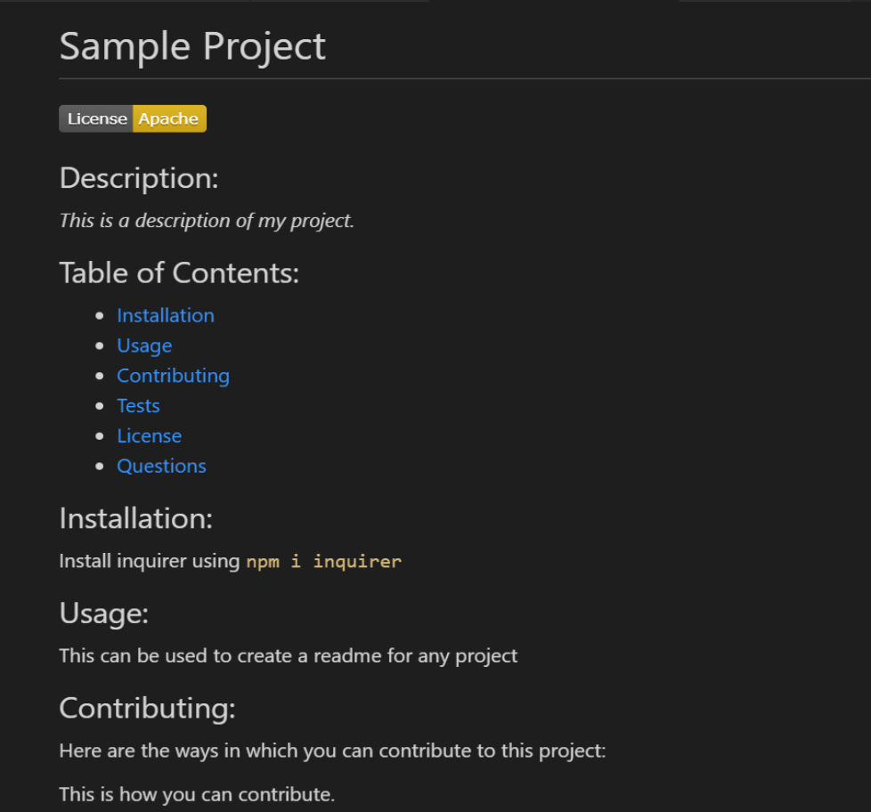
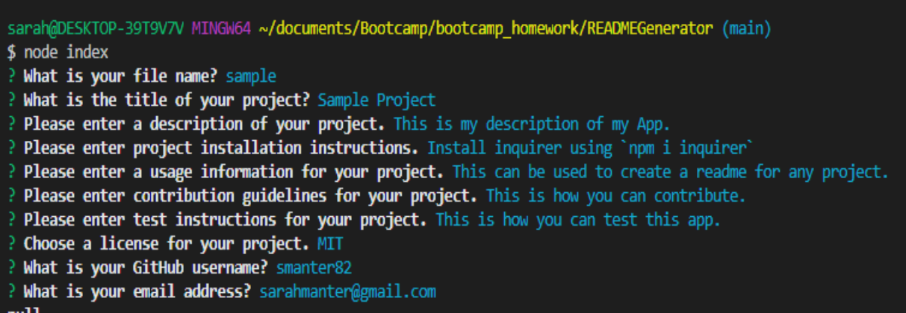

# READMEGenerator

## Description

This app is a Readme generator. It is used for quickly creating professional Readme.md files to attach to new projects. The user answers a list of questions, and the answers to those questions are fed into template to create a new .md file.

## Screenshots

## Table of Contents

- [Technologies](#Technologies)
- [Usage](#Usage)
- [Installation](#Installation)
- [Feedback](#Feedback)
- [Challenges](#Challenges)
- [Walkthrough](#Walkthrough)

## Technologies

- node.js
- inquirer package
- file system (fs)

## Usage

In the node.js integrated terminal, run "node index.js"
Type in answers to each question prompt that pops up in the command line.
Upon completion of the inquirer prompts, a .md file will be created with the title you provided as an answer to the first question. You can then attach that file to your new project.

## Installation

- Install [node.js](https://nodejs.org/en/download/)
- In node.js Integrated Terminal, run `npm install inquirer`

## Feedback

Contact me with any feedback or questions through GitHub or by email.

- [GitHub](https://github.com/smanter82)
- Email: sarahmanter@gmail.com

## Challenges

- writeFile
- the idea of a markdown file
- licenses/badges

## Walkthrough

[Walkthrough_Video](./Assets/ReadmeApp_Walkthrough.webm)

## Sample file

[Sample_Readme](./Assets/Sample.md)

Some code on this application may have been done in collaboration with my Bootcamp study group classmates: https://github.com/arensalmela, https://github.com/dmaysteinman, https://github.com/EddiePhi, https://github.com/ReindeerCode, https://github.com/DustinErwin, https://github.com/Ewager1, https://github.com/mdjonestwo, https://github.com/shannonquinn91/Note-Taker, https://github.com/JesalDM
